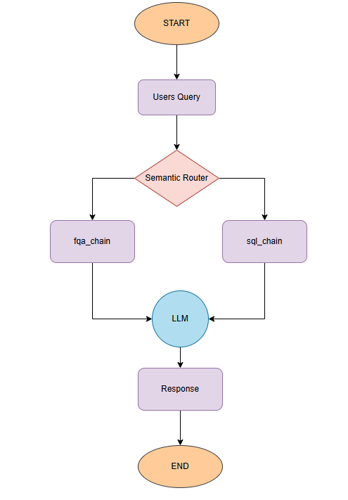

# AI_chat_bot_Ecommerce
This is a POC of an Chatbot for an ecommerce platform. 

## Flowchart


### Setup and execution.

1. Install the dependencies as per requirements.txt
2. Place the below keys in .env file
    ```bash
    GROQ_MODEL=<Add the model name, e.g. llama-3.3-70b-versatile>
    GROQ_API_KEY=<GROQ api key>
    ```
3. run the streamlit app
    ```bash
    streamlit run app/main.py
    ```
